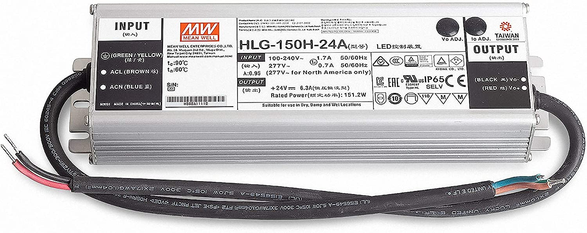

# Верхний свет в спальне из светодиодных лент

## Цель

Красивое и удобное освещение. Свет не должен бить в глаза, 
должен идти со всех сторон, он должен прогревать углы.

## Материалы

Для задуманной конструкции понадобятся:
 * алюминиевые профиля с рассеивателями;
 * светодиодные ленты;
 * блок питания;
 * контроллер освещения;
 * крепёжные элементы.

Профиль и крепления

Светодиодная лента

Блок питания

Контроллер освещения

Выглядит не сложно.

### Выбор материалов

Заказал на amazon.de несколько разных светодиодных лент на пробу, купил
один метр профиля с рассеивателем в локальном строительном магазине, 
заказал там же на амазоне ещё профилей, блок питания, контроллер с пультом.

### Результат экспериментов с материалами

1. Лучше всего использовать угловые профиля, которые имеют поверхность для светодиодной ленты с наклоном 45 градусов;
2. Ленты [COB](led-stripe-cob.jpg) заметно более тусклые, чем обычные;
3. Для спальни лучше всего тёплый белый свет;
4. На одном метре светодиодной ленты, расчитанной на 24В, теряется примерно 0.3В напряжения. На 5 метрах теряется 1,5В;
5. Выбирать лучше ленты, предназначенные для жилых помещений, имеющих индекс цветопередачи > 90;
6. Надо обращать внимание на толщину стенок профилей.

## Теоретические основы

Яркость светодиода пропорциональна силе проходящего через него тока, в рабочих рамках. Чем сильнее сила тока, тем выше
яркость, а, так же, теплоотдача, нагрев. Чтобы светодиод не перегревался и от этого не выходил из строя или деградировал,
необходимо охлаждение. Я выбрал алюминиевые профили, котороые должны хорошо отводить тепло от светодиодоа и рассеивать его
в окружающее пространство.

Светодиодные ленты устроены следующим образом: два параллельных проводника, к которым подключены блоки по 3, 6 или 7 светодиодов. 
Для 12В лент это всегда 3 светодиода и резистор, для 24В это 6 или 7 светодиодов и 2 или один резистор. Каждый отдельный блок
получает на вход 12В или 24В. Каждый светодиод потребляет около 3В, но, поскольку в проводниках всегда есть потери, то реальное
напряжение, приходящее на блок, достигает расчётных 12В или 24В только в начале ленты, поэтому делается запас в 1 светодиод и 
компенсирующий резистор, чтобы сбросить на него лишнее напряжение. Идеальный вариант, когда вместо резистора стоит чип, 
регулирующий ток через светодиоды, тогда все блоки светили бы одинаково, но такие ленты стоят в несколько раз дороже обычных.

Преимущество 24В светодиодных лент перед 12В в том, что для одной и той же мощности $P = U * I$ при большем напряжении нужен
меньший ток. А при меньшем токе на том же сопротивлении, согласно закону Ома: $U = R * I$, потеряется меньшее напряжение.
Это значит, что те же самые проводники тока потеряют меньше мощности при передаче тока. Второй плюс в том, что для 12В каждый блок
светодиодов имеет 3 светодиода и 1 резистор, а для 24В он может иметь 7 светодиодов и 1 резистор, что позволяет достичь большей
яркости, большей эффективности. К сожалению, некоторые 24В светодиодные ленты выбирают вариант с 6 светодиодами в блоке, фактически,
этр как два светодиодных блока от 12В ленты, соединённые последовательно. Преимущество от уменьшенных потерь при передаче тока при этом 
остаётся, но "сэкономленный" светодиод, фактически, вместо излучения света просто излучает тепло на резисторе.

Одна из особенностей светодиода в том, что напряжение, которое он потребляет, зависит от силы проходящего тока. Чем больше ток, тем
больше напряжение, что увеличивает потребляемую мощность не пропорционально. Повышение силы тока за пределы рабочего диапазона
может вести к перегреву, деградации и выходу из строя. Есть и обратная зависимость: при определённом стабилизированном напряжении
светодиод будет потреблять определённую силу тока. Чем меньше напряжение, тем меньше сила тока, меньше яркость. Блоки питания для
светодиодных лент должны выдавать стабилизированное напряжение.

Контроллер освещения управляется пультом. Он включается между блоком питания и светодиодной лентой и регулирует яркость светодиодов
методом широтно-импульсной модуляции. Пульт работает на радиочастоте, ему не страшны препятствия, стены, направления, работает беспроблемно.

## Практические проблемы и борьба с ними

* Первая практическая проблема - найти светодиодную ленту на 24В, у которой блоки по 7, а не по 6 светодиодов;
* Борьба с сопротивлением проводников;
* Стабилизированное напряжение с блока питания.

Долгим сканированием амазона, мне удалось найти [подходящую ленту](https://amzn.eu/d/6OBA9Z1). Не слишком научный эксперимент из подручных материалов показал, 
что она действительно заметно более яркая в сравнеии с [похожей](https://amzn.eu/d/1lUsPXO) по электрическим характеристикам, но с блоками по 6 светодиодов.
Освещение смартфона с включенным приложением люксометра показало заметное преимущество. Люксометр показал аж на 50% большую яркость у первой ленты.

Вторую проблему я решал тем, что заметно более толстыми проводами, чем проводники на ленте, провёл параллельно ток от блока питания к дальнему концу ленты и, получается,
запитал её с обоих концов. Это выровняло яркость ленты. Конструкция профиля позволяет провести дополнительные провода прямо внутри него.

Третья проблема самая неочевидная. Блок питания, который должен выдавать 24В, при испытаниях на одном метре ленты выдаёт ровно то, что просили: 23,95В. 
Но, когда мы подключаем большую длину, то напряжение, выдаваемое блоком питания, падает. От этого падает ток на светодиодах, света получается меньше, чем расчитано.
Эффект проверен на блоках питания [PB-Versand](https://amzn.eu/d/dgPdlqH), [24 V 150 W 6.25 A](https://amzn.eu/d/d356toy), [24 V 100 W 4.16 A](https://amzn.eu/d/7Km75xw).

## Практическая реализация

